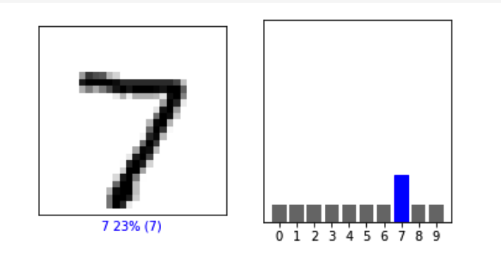

**1) In the video, First steps in computer vision, Laurence Maroney introduces us to the Fashion MNIST data set and using it to train a neural network in order to teach a computer “how to see.” One of the first steps towards this goal is splitting the data into two groups, a set of training images and training labels and then also a set of test images and test labels. Why is this done? What is the purpose of splitting the data into a training set and a test set?**

The initial data set is split into two sets: the training and the testing data. This is because the first set (the training data) is what we expose to the neural network in order to train it (it matches the training images with the training labels). Then the testing data serves as data that we can use to test the neural network (an effective test, for both humans and neural networks, requires new, unseen data). This way, we can accurately test out how the neural network's model holds up for new data that it has never seen before (it will match the test images with the test labels).

**2) The fashion MNIST example has increased the number of layers in our neural network from 1 in the past example, now to 3. The last two are .Dense layers that have activation arguments using the relu and softmax functions. What is the purpose of each of these functions. Also, why are there 10 neurons in the third and last layer in the neural network.**

The first layer, a Flatten, is a special type of type of layer that doesn't contain any neurons. Instead, it serves the function of flattening the rectangular data into a one-dimensional array. This can then be processed by the next layer. The second layer is a .Dense layer, which has the activation argument using the function relu. This function sets any output that is less than zero to zero. This serves the purpose of avoiding skewing the results downstream (as negative  negative output may cancel out other positive outputs). The third layer, another .Dense layer, has the activation argument using the softmax function. Each of the neurons in this layer will be a probability that the item of clothing matches that class. Softmax equates the largest value to 1 and the rest to zero, thereby helping to find the most likely candidate.

There are 10 layers in the third and last layer of the neural network as it represents all the possible categories the image can be classified as.

**3) In the past example we used the optimizer and loss function, while in this one we are using the function adam in the optimizer argument and sparse_categorical- crossentropy for the loss argument. How do the optimizer and loss functions operate to produce model parameters (estimates) within the model.compile() function?**

The machine first makes a guess. The loss function looks at how good the machine was in guessing the correct label to the correct image. Then, the optimizer takes that information and uses it to make a new guess. This new guess is put through the loss function again. This new loss information is used in the optimizer argument. This adjustment of parameters continues to occur until the maximum accuracy is reached (within the number of epochs specified).

**4) Using the mnist drawings dataset (the dataset with the hand written numbers with corresponding labels) answer the following questions.**

  **a) What is the shape of the images training set (how many and the dimension of each)?**
There are 60,000 in the training set, with dimensions of 28x28

  **b) What is the length of the labels training set?**
There are 60,000 labels (label values are from 0-9)

  **c) What is the shape of the images test set?**
10,000 images, with dimensions of 28x28.

  **d) Estimate a probability model and apply it to the test set in order to produce the array of probabilities that a randomly selected image is each of the possible numeric outcomes (look towards the end of the basic image classification exercises for how to do this — you can apply the same method applied to the Fashion MNIST dataset but now apply it to the hand written letters MNIST dataset).**
I tested my code using the first image ('0'). The following was the output:
  array([0.08533914, 0.08533908, 0.08533908, 0.08535428, 0.08533907,
         0.08533907, 0.08533907, 0.23193258, 0.0853391 , 0.08533957],
        dtype=float32)

  **e) Use np.argmax() with your predictions object to return the numeral with the highest probability from the test labels dataset.**
Using the same as above, I got 7.

  **f) Produce the following plot for your randomly selected image from the test dataset**

class_names = ['0', '1', '2', '3', '4',
               '5', '6', '7', '8', '9']

def plot_image(i, predictions_array, true_label, img):
  true_label, img = true_label[i], img[i]
  plt.grid(False)
  plt.xticks([])
  plt.yticks([])

  plt.imshow(img, cmap=plt.cm.binary)

  predicted_label = np.argmax(predictions_array)
  if predicted_label == true_label:
    color = 'blue'
  else:
    color = 'red'

  plt.xlabel("{} {:2.0f}% ({})".format(class_names[predicted_label],
                                100*np.max(predictions_array),
                                class_names[true_label]),
                                color=color)

def plot_value_array(i, predictions_array, true_label):
  true_label = true_label[i]
  plt.grid(False)
  plt.xticks(range(10))
  plt.yticks([])
  thisplot = plt.bar(range(10), predictions_array, color="#777777")
  plt.ylim([0, 1])
  predicted_label = np.argmax(predictions_array)

  thisplot[predicted_label].set_color('red')
  thisplot[true_label].set_color('blue')

i = 0
plt.figure(figsize=(6,3))
plt.subplot(1,2,1)
plot_image(i, predictions[i], y_test, x_test)
plt.subplot(1,2,2)
plot_value_array(i, predictions[i],  y_test)
plt.show()
