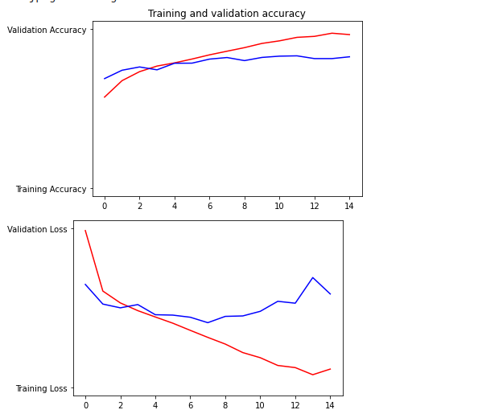

# July 20

## Describe your implementation of the cats & dogs exercise. How did you set up the data?
***Which optimizer have you selected, and how might it compare to other possible choices?***

The optimizer that I used for the lab was the RMSprop optimizer. RMSprop is an optimization algorithm that takes into account each weight and its movement through the squared gradient, keeping a moving average of each squared gradient for each weight. RMSprop is best used when working with large datasets or performing mini-batch weight updates. Rprop could also be used as an optimizer. It combines both the sign of the gradient and adapting step sizes for each weight. So instead of just looking at the magnitude of a gradient, you could look at the step size that is specifically designed for each step.

***Describe your selected loss function and its implementation. How is it effectively penalizing bad predictions?***

The loss function that I used was “binary-crossentrpy”.  Since this was a binary classification problem, the model assigned a classification probability for each data point. After a probability is produced by the model, said probability is then evaluated by the loss function for accuracy when compared to the true value of each data point. The higher the probability score, the lower the loss and vice versa. The overall loss is then calculated by finding the negative log of each probability and then computing the mean of all the losses. With cross-entropy, the loss function computes the entropy of the true values of the distribution of data points as well as of the predicted values for the distribution. The closer the two values are, the lower the cross-entropy. A lower cross-entropy value is desired, it indicates that the predicted value was close to the true value of the data point.

***What is the purpose of the metric= argument in your model.compile() function?***

The metrics argument in my model.compile function() is used to judge the performance of a model. Although similar to loss functions the results of the metric evaluation are not used to train a model. In this specific case, the metric that was tracked in the model was the accuracy of the model, or how often the predicted labels match the labels of the data given.

***Plot the accuracy and loss results for both the training and test datasets. Include these in your response. Assess the model and describe how good you think it performed.***

We can see in the graphs above that as the number of epochs went up, so did the training and validation accuracy but that the training accuracy was higher than the loss. Validation loss increased as the number of epochs increased and that training loss increased as well. This indicates that the model may be overfit. 

***Use the model to predict 3 dog images and 3 cat images. Upload your images and the prediction. How did your model perform in practice? Do you have any ideas of how to improve the model’s performance?***

The first image was of a cat, as you can see below, and the model correctly identified it as a cat.

The second image was also of a cat and was correctly identified as a cat.

The third image, another cat, was correctly identified.

The fourth image, a dog, was unfortunately misidentified as a cat.

The fifth image, also a dog, was again misidentified as a cat.

The last image was correctly identified as a dog.

In practice, the model performed ok; as you can see from the results, ⅖ of the images were mis-identified, which isn’t great. I think that raising the number of epochs may improve the model. 
